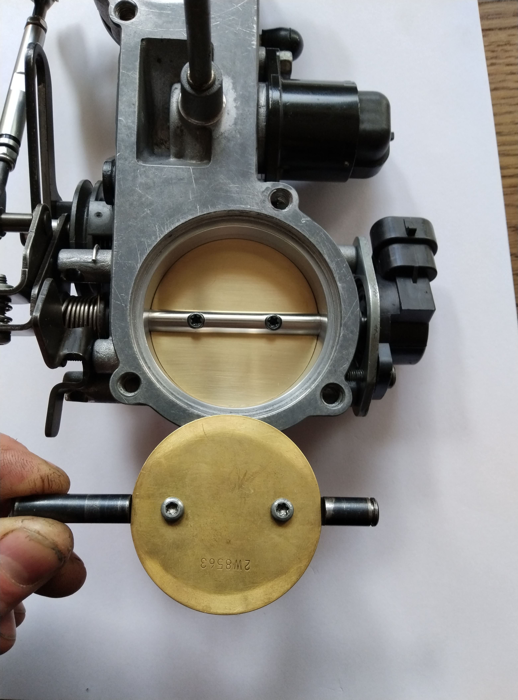
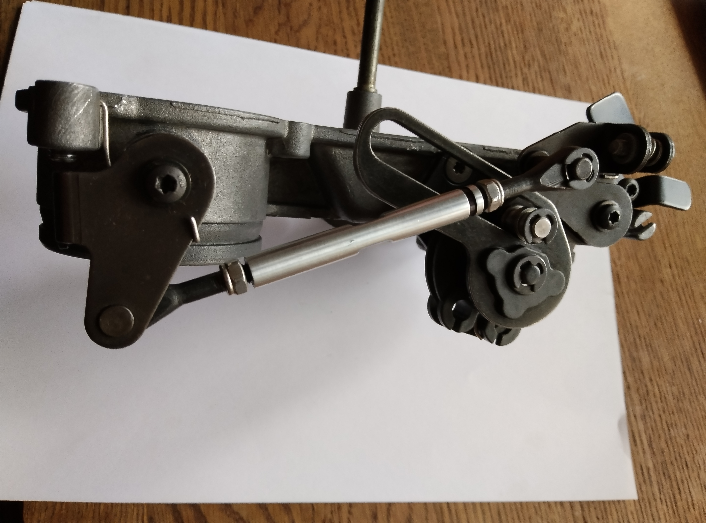
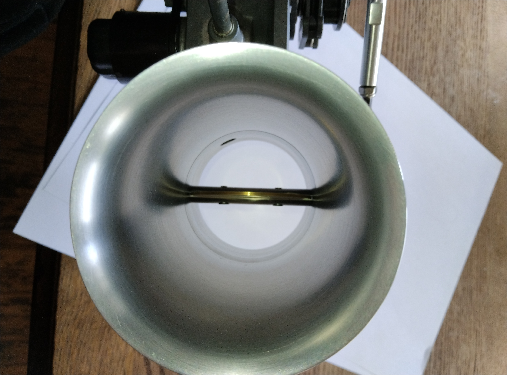
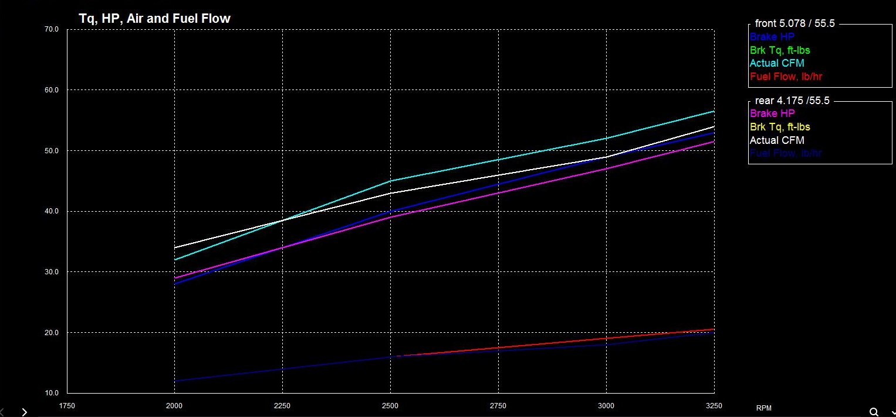
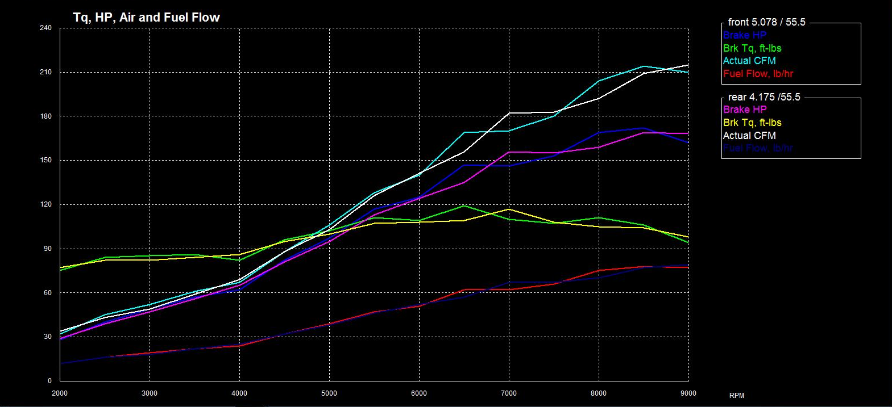
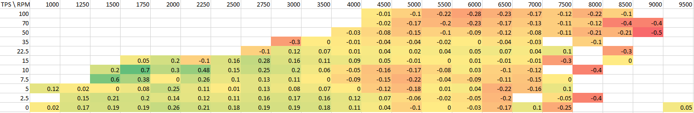
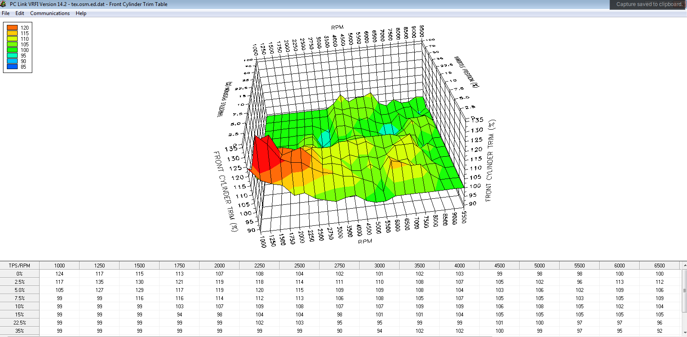
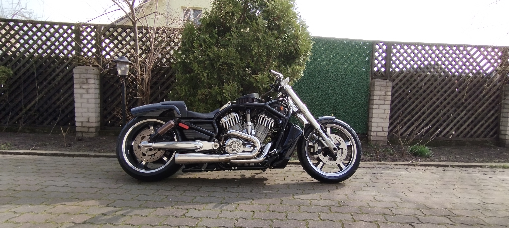

# VRod-Custom-55.5mm-ITB-Telemetry
Deep modernization, custom 55mm throttle bodies, asymmetric intake calculation, and Python/Arduino telemetry for H-D V-Rod

##  About the Project
A comprehensive project focused on deep modernization of the H-D Revolution (1250cc) engine intake system. It includes custom hardware machining, gas dynamics calculation (Engine Simulation), and the development of a software-hardware suite for telemetry data logging and analysis.

**Goal:** Upgrading from the stock 53mm throttle bodies to 55.5mm while maintaining a stable idle and maximizing volumetric efficiency at 9000 RPM.

---

##  Hardware & CAD
Stock throttle shafts and butterfly valves cannot withstand the increased load when the diameter is enlarged. The assembly was designed from scratch:

* **Throttle Bodies:** Bored out to 55.5mm.
* **Shafts (Split Shaft):** Custom 8mm stainless steel split shafts. Screws were secured using the ball-staking method (aviation standard) to prevent failure from severe V-Twin vibrations. PTFE bearings were installed for smooth operation.
* **Butterfly Valves:** Machined from hard free-cutting brass (LS59-1 / CuZn39Pb2 equivalent, 1.5mm thick). 
* **Geometry:** Modeled as an ellipse at a 4.5° angle. A critical 23-micron (0.023 mm) interference gap near the shaft was calculated and eliminated in CAD, ensuring 100% sealing when the throttle is closed (perfectly stabilizing the IAC control).

---

##  Gas Dynamics & Simulation (Engine Analyzer Pro)
The V-Rod engine features unequal-length exhaust headers (Rinehart 2-1: Front 72 cm / Rear 85 cm). To compensate for volumetric efficiency (VE) differences, an asymmetric intake system was calculated:

* **Front Stack:** 12.7 cm — compensates for the short exhaust header, creating inertial supercharging (ram effect) at 6500-7000 RPM.
* **Rear Stack:** 9.5 cm — allows the cylinder to breathe effectively at 8500-9000 RPM.

The simulation proved that at exactly 2250 RPM, the airflow (CFM) between the two cylinders balances out, providing the perfect point for mechanical ITB synchronization.

---

##  Software & Telemetry (Data Engineering & Tuning)
The **Daytona Twin Tec (Alpha-N)** system was used to tune this custom hardware setup.

* **Data Logging:** Custom Python scripts were written to parse, filter hardware noise, and aggregate raw logs.
* **Synchronization:** The `MAP Delta` analysis confirmed a flawless mechanical assembly (the vacuum difference at idle was only 0.03 in-Hg).

---

##  Results
A fully functional and calibrated system that surpasses factory analogs in reliability (stainless steel + hard brass) and aerodynamics. Achieved a perfect idle and a smooth, flat power band up to 9500 RPM.

---
